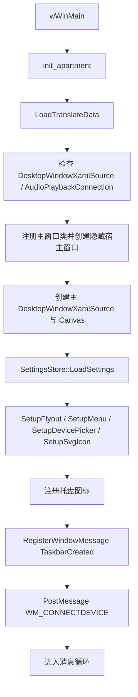
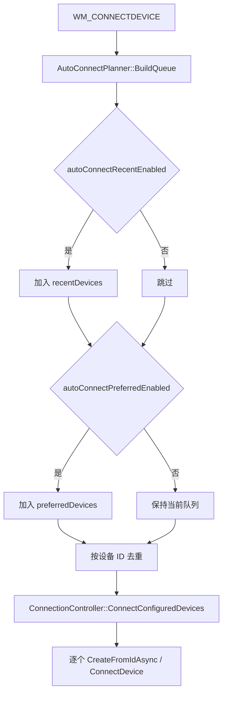
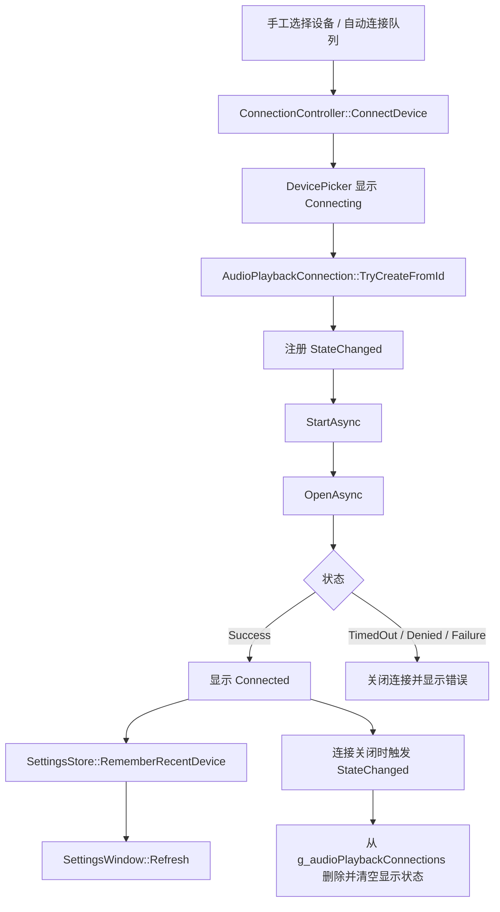

# 架构说明

## 总体思路

程序本质上是一个隐藏的 Win32 桌面应用，围绕托盘图标组织交互，再通过 XAML Island 承载菜单、退出确认和独立设置窗口。蓝牙设备发现与连接依赖 Windows Runtime 的 `DevicePicker` 和 `AudioPlaybackConnection`；长期设置通过本地 JSON 持久化；开机自启动通过 Windows Task Scheduler COM API 管理。

可以把当前实现理解为 7 个协作层：

1. Win32 宿主层：窗口类、消息循环、通知区图标、任务栏重建
2. 主 XAML Island 层：右键菜单、退出确认 Flyout
3. 设置窗口层：独立 Win32 窗口 + 独立 XAML Island
4. 设备与连接层：`DevicePicker`、`AudioPlaybackConnection`
5. 设置存储层：`SettingsStore`
6. 自启动管理层：`AutostartManager`
7. 资源层：本地化、SVG 图标、资源脚本与清单

## 关键运行对象

### Win32 宿主

- `g_hWnd`：隐藏主窗口，也是通知区消息与主 XAML Island 的宿主
- `g_hWndXaml`：主 XAML Island 子窗口句柄
- `WM_NOTIFYICON`：托盘图标事件
- `WM_CONNECTDEVICE`：启动后驱动自动连接的自定义消息
- `WM_TASKBAR_CREATED`：任务栏重建后重新注册托盘图标

### 主 XAML UI

- `g_mainDesktopSource` / `g_mainDesktopSourceNative2`：主窗口侧的 XAML Island 宿主
- `g_xamlCanvas`：菜单与退出 Flyout 的挂载点
- `g_xamlFlyout`：退出确认弹层
- `g_xamlMenu`：右键菜单
- `g_menuFocusState`：记录菜单由鼠标还是键盘唤起

### 设置窗口

- `SettingsWindow::State`：设置窗口运行态集中体
- `SettingsWindow::State::desktopSource`：设置窗口自己的 XAML Island
- `SettingsWindow::State::preferredDevicePicker`：仅用于把设备加入固定列表，不直接发起连接

### 设备与连接状态

- `g_devicePicker`：主设备选择器，用于手工连接和显示连接状态
- `g_audioPlaybackConnections`：当前活动连接表，键为设备 ID
- `g_settings`：当前内存中的长期配置

## 启动流程



启动后不立即同步执行自动连接，而是先完成主窗口、菜单、`DevicePicker` 和托盘图标初始化，再通过 `WM_CONNECTDEVICE` 延迟进入自动连接路径。

## 菜单与设置窗口流程

### 左键托盘图标

1. `WM_NOTIFYICON` 收到 `NIN_SELECT` / `NIN_KEYSELECT`
2. 通过 `Shell_NotifyIconGetRect` 获取图标位置
3. 按当前 DPI 转换成 XAML 使用坐标
4. 把主窗口临时置前
5. 调用 `g_devicePicker.Show(...)` 弹出设备选择器

### 右键托盘图标

1. `WM_RBUTTONUP` 记录焦点来源为鼠标
2. `WM_CONTEXTMENU` 计算菜单弹出点
3. 显示主 XAML Island 宿主
4. 通过 `g_xamlMenu.ShowAt(g_xamlCanvas, point)` 打开菜单
5. 菜单关闭后隐藏主宿主窗口

### 设置窗口

右键菜单中的 `Settings` 会打开单实例设置窗口：

- 如果窗口不存在，创建新的 Win32 顶层窗口和独立 XAML Island
- 如果窗口已存在，只前置并刷新
- 设置窗口内所有开关和列表操作都是即时生效，不存在“应用 / 取消”

设置窗口当前分为 4 个区域：

- `Startup`：开机自启动开关
- `Auto connect`：最近设备、固定设备两类自动连接开关
- `Preferred devices`：固定设备列表与“Add device”
- `Recent devices`：最近连接设备列表与“Clear”

## 自动连接流程



规则如下：

- 最近设备优先，固定设备作为补集追加
- 去重单位是设备 ID
- 固定设备不会因为一次连接失败或断开而自动删除
- 手工连接成功后会刷新 `recentDevices`

## 连接生命周期



`ConnectionController` 统一处理：

- 手工连接
- 自动连接
- 连接成功后的最近设备回写
- 失败后的状态清理

## 设置持久化模型

配置文件固定为可执行文件同目录的 `AudioPlaybackConnector.json`。当前结构如下：

```json
{
  "autostartEnabled": false,
  "autoConnectRecentEnabled": true,
  "autoConnectPreferredEnabled": false,
  "preferredDevices": [
    { "id": "...", "displayName": "..." }
  ],
  "recentDevices": [
    { "id": "...", "displayName": "...", "lastConnectedTimestamp": 1710000000 }
  ]
}
```

兼容规则：

- 旧版 `reconnect` 会迁移为 `autoConnectRecentEnabled`
- 旧版 `lastDevices` 会迁移为 `recentDevices`
- 迁移后的结构在下一次保存时写回新格式

## 开机自启动实现

`AutostartManager` 通过 Task Scheduler COM API 管理任务：

- 任务名：`AudioPlaybackConnector_Autostart`
- 范围：当前用户
- 触发器：用户登录
- 延迟：15 秒
- 动作：启动当前可执行文件
- 工作目录：可执行文件目录

设置窗口打开时会读取任务实际状态；开关切换时立即创建或删除任务，并把结果回写到配置。

额外的自愈逻辑：

- 程序启动时会检查现有任务是否已启用
- 如果任务已启用，但目标 exe 不存在或不再指向当前正在运行的副本，会自动重建任务到当前 exe
- 设置窗口刷新时也会执行同样的校验，避免 UI 长时间显示过期状态

## 本地化初始化

`LoadTranslateData()` 现在在 `wWinMain` 早期显式调用。也就是说：

- `_()` / `C_()` 使用的翻译表会在 UI 初始化前装载
- 菜单、设置窗口、错误对话框都依赖这一步

## 图标主题切换

托盘图标仍然按旧架构工作：

1. 从 `SVG` 资源中读取原始图标
2. 运行时生成浅色与深色两个 `HICON`
3. 读取 `SystemUsesLightTheme`
4. 在 `WM_SETTINGCHANGE` 时刷新托盘图标

## 当前架构的优点与代价

### 优点

- 保留了原项目轻量、托盘优先的交互路径
- 自动连接、自启动、设置窗口已经从“退出时一次性选项”升级为长期配置
- 新增职责已拆出独立模块，主入口比之前更清晰

### 代价

- 全局状态仍然存在，模块间仍通过共享状态协作
- 新模块大多是头文件内联实现，编译边界仍不强
- 缺少自动化测试，重构和回归验证仍依赖手工测试
